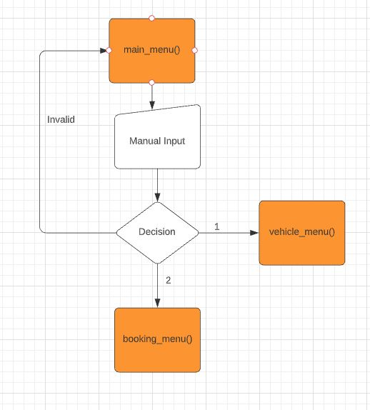
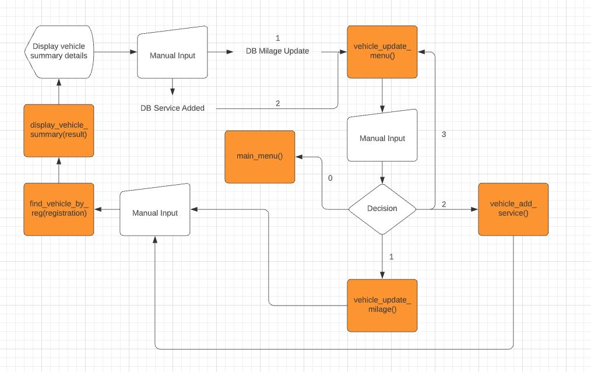

# Motorcycle Rental Management

TODO Gif of live site

## Table Of Contents

* [Introduction](#Introduction)
    * [Site Goals](#Site-Goals)
    * [Target Audience](#Target-Audience)
    * [User stories](#User-Stories)
    * [Features Planned](#Features-Planned)
- [Structure](#Structure)
    * [Logical Flow](#Logical-Flow)
    * [Features](#Features)
    * [Features left to Implement](#Features-Left-to-Implement)
* [Technologies](#Technologies)
* [Testing](#Testing)
    * [Functional Testing](#Functional-Testing)
    * [Pep8 Validation](#Pep8-Validation)
    * [Bugs and Fixes](#Bugs-and-Fixes)
* [Deployment](#Deployment)
    * [Version Control](#Version-Control)
    * [MongoDB Setup](#MongoDB-Setup)
    * [Heroku Deployment](#Heroku-Deployment)
    * [Clone Locally](Clone-Locally)
* [Credits](#Credits)
  * [Content](#Content)

## Introduction

This project was created in order for small businesses to easily keep track of their Vehicle rentals. It will allow them to keep track of vehicle and bookings information as well as update them.

### Site Goals

* Provide a simple application to allow the site owner to keep track of vehicles, bookings and maintenance for their rental business.

### Target Audience

* Small vehicle rental companies that want to keep track of stock, bookings and view daily reports.

### User Stories

* As a User, I would like to be able to easily find the various menus so that I can view information or add / edit records.
* As a User, I would like to be able to manage my vehicles so that I can easily keep track of what vehicles I have available and edit / remove as neccessary.
* As a User, I would like to be able to manage bookings so that I can add, delete and find customer bookings with ease.
* As a User, I would like to be able to view sevice records so I can see estimate when a new service is due.
* As a User, I would like to be able to return to the main menu without having to restart the application.

### Features Planned

* Simple, easy to use application with clear navigation.
* Simple database storage for:
    * Create, read, update and delete functionality for vehicles.
    * Create, read and delete functionality for vehicle bookings.
* Ability to view service records.
* Return to main menu option through sub menus.

## Structure

### Features

USER STORY

`
As a User, I would like to be able to easily find the various menus so that I can view information or add / edit records.
`

IMPLEMENTATION
* Main Menu
    * When the application starts, a main menu will appear with the following options:
        * 1 - Vehichles
        * 2 - Bookings
    * The user must input a correct number corresponding to each menu or they will be alerted of an inccorect choice and the menu will be presented again.
    * This feature will allow the user to easily access the sub menus to each category in order to perform the operations needed.


USER STORY

`
As a User, I would like to be able to manage my vehicles so that I can easily keep track of what vehicles I have available and edit / remove as neccessary.
`

`
As a User, I would like to be able to view sevice records so I can see estimate when a new service is due. (Fulfilled on option 4)
`

IMPLEMENTATION
* Vehicle Menu
    * When the user selects Vechicles from the main menu, the following menu options will appear:
        * 1 - Add new - This option will ask for user input on the vehicle and once all data is input, will save the data to MongoDB.
        * 2 - Update - This option will open the Vehicle Update Menu, implementation described below.
        * 3 - Remove - This option will allow the user to delete a vehicle from MongoDB after inputting registration and confirming deletion.
        * 4 - Service History - This option whille allow the user to view a vehicles service history.
        * 5 - List All - This option will display all vehicles currently stored in mongoDB.
        * 0 - Main Menu - This option will return the user to the main menu.
    * The user must input a correct number corresponding to each menu or they will be alerted of an inccorect choice and the menu will be presented again.
    * This feature will allow the user to easily view, add, edit and delete vehicles. 

Vehicle Menu


Add new


Remove


Service History


List All


* Vehicle Update Menu
    * When vehicle update menu has been selected, the following menu options appear:
        * 1 - Add new milage - This will allow user to find vehicle and update milage. This also sets the next service due field.
        * 2 - Add service - This will allow the user to find vehicle and add new service details.
        * 3 - Back to vehicle menu - This will allow the user to go back to the vehicle menu.
        * 0 - Main Menu - This option will return the user to the main menu.

Update Menu


Add new Milage


Add service


USER STORY

`
As a User, I would like to be able to manage bookings so that I can add, delete and find customer bookings with ease.
`

IMPLEMENTATION
* Booking Menu
    * When the user selects Bookings from the main menu, the following menu options will appear:
        * 1 - New Booking - This option will ask for user input on the new booking and once all data is input, will save the data to MongoDB.
        * 2 - List Bookings - This option will display all upcoming bookings for number of days specified on input for bookings currently stored in MongoDB.
        * 3 - Find Booking - This option will allow the user to search for a specific booking, view details and the following option will be available:
            * Cancel booking (Enter "c") - This will allow the user to cancel the booking.
        * 4 - Check availability - One - This will allow the user to check the availability of one vehicle between 2 dates. If vehicle is available, an option is given to add a booking and the new booking function is called.
        * 5 - Check availability - All - This lists all available vehicles between 2 dates and takes an input of start date and end date.
       * 0 - Main Menu - This option will return the user to the main menu.
    * The user must input a correct number corresponding to each menu or they will be alerted of an inccorect choice and the menu will be presented again.
    * This feature will allow the user to easily view, add and search for a booking.


New booking


List Bookings


Find Booking


Cancel Booking


Check Availability - One


Check Availability - All


USER STORY

`
As a User, I would like to be able to return to the main menu without having to restart the application.
`

IMPREMENTATION
* All sub menus will have an option to return to the main menu, this will typically be 0.
* This will allow the user to return to the main menu if they selected the wrong option or are finished with the particular menu.

This can be seen on all the menu screenshots above.

### Features Left to Implement

As a future enhancement, I would like to add some basic functionality to calculate pricing and keep track of sales. I would also like to implement reporting to the application that will allow users to view sales records.

### Logical Flow

**Main Menu**



**Vehicle Menu**


**Vehicle Update Menu**



**Booking Menu**


## Technologies

* Python - Python was the main language used to build the application.
    * Python packages used:
        * pymongo - Used to connect to the MongoDB atlas from the application.
* MongoDB - This was used as data storage in order to store the bike and booking information.

## Testing

### Functional Testing

Below are the test execution of positive functional tests:


Negative input validation testing was performed on all menu options to ensure correct input. All options behaved as expected, alerting the user of invalid inoput and then asking for input again.

### Pep8 Validation

All python code was ran through pep8online.com validator and any warnings or errors were fixed. Code then validated successfully.

In gitpod, warning was displayed by linter that env was imported but unused. This was being used by my env.py file during local development as it contained my database configuration variables so it was in fact used and the warning was ignored.


### Bugs and Fixes

Vehicles with the same reg were able to be added. A fix was implemented to ensure that duplicate vehicles with the same registration could not be added.

Date validations had to be added that the end date was after the start date in several functions as it allowed a user to input an end date that was before the start date.

Validation was implemented to ensure correct date format was input as this was causing errors when an invalid format was used.

## Deployment

### Version Control
The site was created using the Visual Studio Code editor and pushed to github to the remote repository ‘motorcycle-rental-management’.

The following git commands were used throughout development to push code to the remote repo:

```git add <file>``` - This command was used to add the file(s) to the staging area before they are committed.

```git commit -m “commit message”``` - This command was used to commit changes to the local repository queue ready for the final step.

```git push``` - This command was used to push all committed code to the remote repository on github.

### MongoDB Setup

* Navigate to [MongoDB](https://www.mongodb.com/) and create an account.
* Verify account by clicking the verification link emailed to you on the email you signed up with.
* Log in with newly created account.
* On the top right under projects, click the drop down and select new project.
* Name the project and click next, filling in subsuqent inputs as desired.
* If prompted, whitelist IP by inputting (0.0.0.0/0) to allow access from anywhere.
* Once the project is created, from the left menu, select Database Access and create a new user with Read and Write access. It's best practice not to use special characters in the password as these will need to be escaped.
* Once a user has been created, you can click the 'Databases' under deployment and then click connect.
* Select the Connect you application option and this will provide you with a Mongo URI connection string that can be used in Heroku or an env file locally.

### Heroku Deployment

The below steps were followed to deploy this project to Heroku:

* Go to Heroku and click "New" to create a new app.
* Choose an app name and region region, click "Create app".
* Go to "Settings" and navigate to Config Vars. Add the following config variables:
    * PORT : 8000
    * MONGO_URI : (Mongo URI connection string from MongoDB setup)
* Navigate to Buildpacks and add buildpacks for Python and NodeJS (in that order).
* Navigate to "Deploy". Set the deployment method to Github and enter repository name and connect.
* Scroll down to Manual Deploy, select "main" branch and click "Deploy Branch".
* The app will now be deployed to heroku

TODO - Live Link

### Clone Locally

* Open IDE of choice and type the following into the terminal:
    * ```git clone https://github.com/Gareth-McGirr/motorcycle-rental-management.git```
* Project will now be cloned locally.

Note: If you want to use the application, follow the steps in the [MongoDB Setup](#MongoDB-Setup) first then create an env.py file with the following variable:
* MONGO_URI : Mongo URI connection String

## Credits

### Code

[Youtube tutorial](https://www.youtube.com/watch?v=qWYx5neOh2s) - This youtube tutorial was used as a crash course on mongodb for all database functionality used within the project.

[Check date range](https://www.geeksforgeeks.org/python-program-to-check-date-in-date-range/) - This tutorial was used to check if a date was within a date range.

[Create Date Range](https://www.delftstack.com/howto/python/create-a-range-of-dates-in-python/) - This tutorial was used to create a date range.

[Sorting dictionary values](https://stackoverflow.com/questions/652291/sorting-a-list-of-dictionary-values-by-date-in-python/652347) - This stackoverflow post was used in order to sort my dictionary values by date.

W3C tutorials were used as a reference for python functions throughout this project.